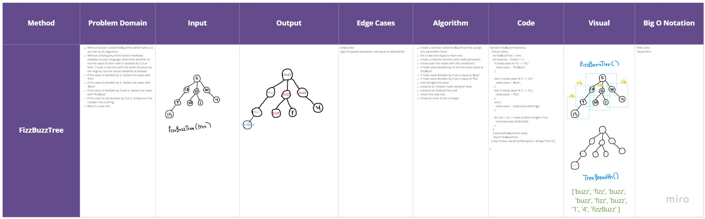

# Fizz Buzz Tree

### Methods & Approach & Efficiency 

**fizzBuzzTree(tree)**

FizzBuzzTree takes tree as an argument.
values modified as follows:
If the value is divisible by 3, replace the value with “Fizz”
If the value is divisible by 5, replace the value with “Buzz”
If the value is divisible by 3 and 5, replace the value with “FizzBuzz”
If the value is not divisible by 3 or 5, simply turn the number into a String.
Return a new tree.

```
- create a function called fizzBuzzTree that accept one parameter (tree)
- set a new tree equal to main tree
- create a traverse function with node parameter
- iterate over the nodes with this conditions :
- if node value divisible by 15 set the value equal to 'FizzBuzz'
- if node value divisible by 3 set it equal to 'Buzz'
- if node value divisible by 5 set it equal to 'Fizz'
- else stringify the value
- traverse on children node using for loop
- traverse on fizzbuzzTree.root
- return the new tree
- throw an error if tree is empty

```

## Tests ~

## [Actions](https://github.com/wafaankoush99/data-structures-and-algorithms/actions)

```
 PASS  Data-Structures/fizzBuzzTree/fizz-buzz-tree.test.js
  Happy Bath
    ✓ Should return "Buzz" If the value is divisible by 5 (3 ms)
    ✓ Should return "Fizz" If the value is divisible by 3
    ✓ Should return "FizzBuzz" If the value is divisible by 3 and 5
    ✓ Should stringify the value if it is not divisible by 3 or 5  (1 ms)
    ✓ Should return new tree after invoke FizzBuzzTree function
  Edge Cases And Expected Faller
    ✓ Should throw an error when invoke fizzBuzz function on empty tree (3 ms)

-----------------------|---------|----------|---------|---------|-------------------
File                   | % Stmts | % Branch | % Funcs | % Lines | Uncovered Line #s
-----------------------|---------|----------|---------|---------|-------------------
All files              |   70.37 |    52.94 |    62.5 |   69.62 |
 fizzBuzzTree          |   97.06 |    83.33 |     100 |   96.88 |
  fizz-buzz-tree.js    |   97.06 |    83.33 |     100 |   96.88 | 36
 stacksAndQueues       |   51.06 |    36.36 |   45.45 |   51.06 |
  stacks-and-queues.js |   51.06 |    36.36 |   45.45 |   51.06 | 23-84,135-138,150
-----------------------|---------|----------|---------|---------|-------------------
Test Suites: 1 passed, 1 total
Tests:       6 passed, 6 total
Snapshots:   0 total
Time:        0.965 s, estimated 1 s

```

***


## [Board](https://miro.com/welcomeonboard/NHFzMHpTUUp1amJnY1d2ZWZZRzVCbEhuVVh4MjNUdHMwTmVrOEl3b0xXVEdydDNKVTlwRWJtQklnZXNPZTgwNnwzMDc0NDU3MzU3MzU4Mjc2Mjk1)




***

[Pull Request](https://github.com/wafaankoush99/data-structures-and-algorithms/pull/56)


