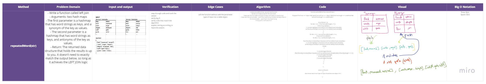

# Tree Intersection

### Methods & Approach & Efficiency 

**joinLeft(firstTree, secondTree)**

- Write a function called left join
- Arguments: two hash maps
- The first parameter is a hashmap that has word strings as keys, and a synonym of the key as values.
- The second parameter is a hashmap that has word strings as keys, and antonyms of the key as values.
- Return: The returned data structure that holds the results is up to you. It doesn’t need to exactly match the output below, so long as it achieves the LEFT JOIN logic

```
- create joinLeft(firstTree, secondTree) function
- declare an empty array for the end result
- loop over the first table and push its keys and values to result array
- loop over the second table .. and if the result array includes the keys thats in the second table .. push them into result array
- if not push a null value to it
```

## Tests ~

## [Actions](https://github.com/wafaankoush99/data-structures-and-algorithms/actions)

```
 PASS  Data-Structures/leftJoin/leftjoin.test.js
  Happy path :)
    ✓ if values exist in the “right” hashmap, they are appended to the result row If not NULL should be appended to the result row. (6 ms)
  Edge cases :(
    ✓ should throw error in an edge case (5 ms)
    ✓ should throw error in an edge case (1 ms)

--------------|---------|----------|---------|---------|-------------------
File          | % Stmts | % Branch | % Funcs | % Lines | Uncovered Line #s
--------------|---------|----------|---------|---------|-------------------
All files     |   69.64 |    81.82 |      80 |   67.92 |
 hashTable.js |   54.05 |    33.33 |   77.78 |   54.05 | 21-29,62-76
 leftjoin.js  |     100 |      100 |     100 |     100 |
--------------|---------|----------|---------|---------|-------------------
Test Suites: 1 passed, 1 total
Tests:       3 passed, 3 total
Snapshots:   0 total
Time:        1.558 s
```

***


## [Board](https://miro.com/welcomeonboard/WFRDTEo3RkFlczhDcG9ZNnAyd3MwQU5LcEJCNFE3a3YwdU53c1BZdXV3dDN2d0Qzd2U0N1hyZ1AwdzNuN3hxR3wzMDc0NDU3MzU3MzU4Mjc2Mjk1)





***

[Pull Request 1](https://github.com/wafaankoush99/data-structures-and-algorithms/pull/64)


