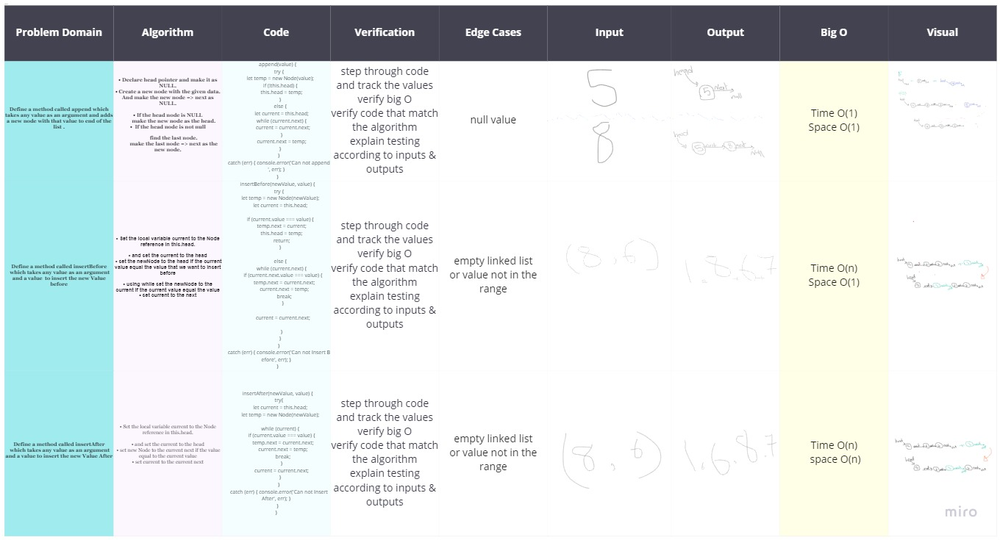

# Singly Linked List
<!-- Short summary or background information -->

## Created Node class that has properties for the value stored in the Node, and a pointer to the next Node. & Extend a Linked List to allow various insertion methods.

&check;  LinkedList class, include a head property. and empty Linked List created.

&check;  **insert() method** 
takes any value as an argument and adds a new node with that value to the head of the list with an O(1) Time performance.

&check;  **includes() method** takes any value as an argument and returns a boolean result depending on whether that value exists as a Node’s value somewhere within the list.

&check;  **toString() method** 
takes in no arguments and returns a string representing all the values in the Linked List, formatted as:
"{ a } -> { b } -> { c } -> NULL"

&check; **append(value) method**
 which adds a new node with the given value to the end of the list

 &check; **insertBefore(value, newVal) method**
  which add a new node with the given newValue immediately before the first value node

&check; **insertAfter(value, newVal) method**
 which add a new node with the given newValue immediately after the first value node

***

## Challenge

## Tests prove the following functionality:

&check; Can successfully instantiate an empty linked list

&check; Can properly insert into the linked list

&check; The head property will properly point to the first node in the linked list

&check; Can properly insert multiple nodes into the linked list

&check; Will return true when finding a value within the linked list that exists

&check; Will return false when searching for a value in the linked list that does not exist

&check; Can properly return a collection of all the values that exist in the linked list

&check; Can successfully add a node to the end of the linked list

&check; Can successfully add multiple nodes to the end of a linked list

&check; Can successfully insert a node before a node located i the middle of a linked list

&check; Can successfully insert a node before the first node of a linked list

&check; Can successfully insert after a node in the middle of the linked list

&check; Can successfully insert a node after the last node of the linked list

***

## Approach & Efficiency

- ### insert(value)

   - create a new instance of Node with the given value and assign it to the head if the linked list is empty.

   - If linked list isn't empty, Create a new instance of Node with the given value and assign it to the temporary variable
Assign to temporary.next the reference in this.head.
Assign to this.head a reference to the new instance.

- ### includes(value)

Set the local variable current to the Node reference in this.head

While current is not null, loop

If current.value is equal to the given value, return with true.

Set current to current.next.

return false.

- ### toString()

set local variable current to Node reference in this.head

declare an empty string

while current is nort NULL

add the current value to the string with concatenate

set current to current.next

- ### append()

• Declare head pointer and make it as NULL.

• Create a new node with the given data. And make the new node => next as NULL.
    (Because the new node is going to be the last node.)

• If the head node is NULL (Empty Linked List),

         make the new node as the head.

• If the head node is not null, (Linked list already has some elements),

         find the last node.

         make the last node => next as the new node.

- ### insertBefore()

• Set the local variable current to the Node reference in this.head.

• and set the current to the head

 • set the newNode to the head if the current value equal the value that we want to insert before

• using while set the newNode to the current if the current value equal the value

• set current to the next

- ### insertAfter()

• Set the local variable current to the Node reference in this.head.

• and set the current to the head

• set new Node to the current next if the value equal to the current value

• set current to the current next

***

## API

### Insert | Include | toString

[Show Board on MERO](https://miro.com/welcomeonboard/hWMltNg2K7jA0YBOgTiBp5itbvCPnhNmYe4i0IIK5GnOK211bP7J5C9tRaJ8n9Ro)

##### [Pull Request](https://github.com/wafaankoush99/data-structures-and-algorithms/pull/37)

### Append | Insert Before | Insert After

[Show Board on MERO](https://miro.com/welcomeonboard/gUzOYvPx7tSNkMiN2R1k3KG8bLA6VbvdjZQcRt0X7VeyiFKT0P38kROhRpyplt3y)

##### [Pull Request](https://github.com/wafaankoush99/data-structures-and-algorithms/pull/43)

