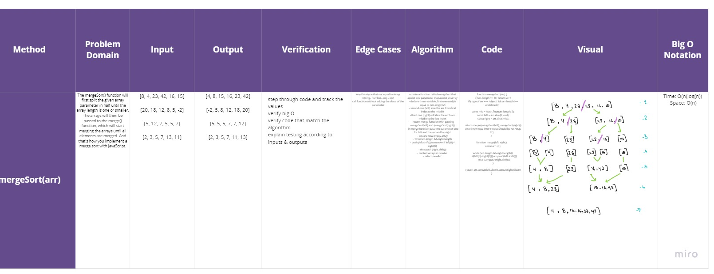
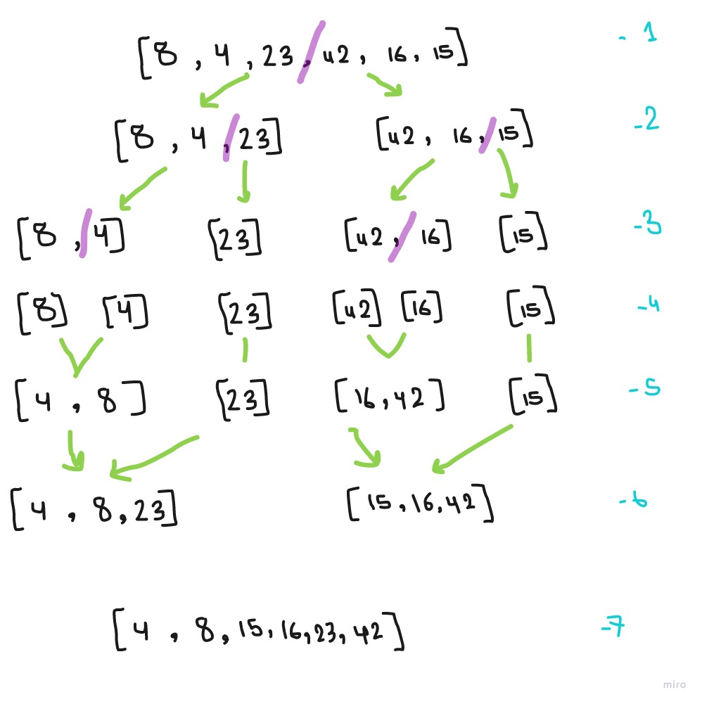

# Merge Sort 

### Methods & Approach & Efficiency 

**mergeSort(arr)**

The mergeSort() function will first split the given array parameter in half until the array length is one or smaller. The arrays will then be passed to the merge() function, which will start merging the arrays until all elements are merged. And that's how you implement a merge sort with JavaScript.

```
- create a function called mergeSort that accept one parameter that accept an array
- declare three variable, first one (mid) is equal to (arr.length/2) 
- second one (left) slice the arr from first index to the middle
- third one (right) will slice the arr from middle to the last index
- return merge function with passing mergeSort(left) and (mergeSort(right))
- in merge function pass two parameter one for left and the second for right
- declare new empty array
- while left.length && right.length 
- push (left.shift()) to newArr if left[0] < right[0]
- else push (right.shift()) 
- contact arrays in newArr
- return newArr


```

## Tests ~

## [Actions](https://github.com/wafaankoush99/data-structures-and-algorithms/actions)

```
 PASS  Data-Structures/mergeSort/mergeSort.test.js
  Happy Path
    Shoule retirn sorted array in these cases
      ✓ Normal case (2 ms)
      ✓ Reverse-sorted (1 ms)
      ✓ Few uniques
      ✓ Nearly-sorted
  Edge Cases And Failer Path
    Should Throw an error if the input is not an array
      ✓ String (4 ms)
      ✓ number
      ✓ object (1 ms)

--------------|---------|----------|---------|---------|-------------------
File          | % Stmts | % Branch | % Funcs | % Lines | Uncovered Line #s
--------------|---------|----------|---------|---------|-------------------
All files     |     100 |      100 |     100 |     100 |
 mergeSort.js |     100 |      100 |     100 |     100 |
--------------|---------|----------|---------|---------|-------------------
Test Suites: 1 passed, 1 total
Tests:       7 passed, 7 total
Snapshots:   0 total
Time:        0.909 s, estimated 1 s

```

***


## [Board <==](https://miro.com/welcomeonboard/MWV6ZVF0eXM0OTBpRmJIclRnSUlVbFBPenNEZVY4cTJDaHZmTzVlc3pjaXBJVDVucWNVVjdGRThrRVFHUm5ZVnwzMDc0NDU3MzU3MzU4Mjc2Mjk1)





## [Blog <==](./blog.md)


***

[Pull Request](https://github.com/wafaankoush99/data-structures-and-algorithms/pull/59)