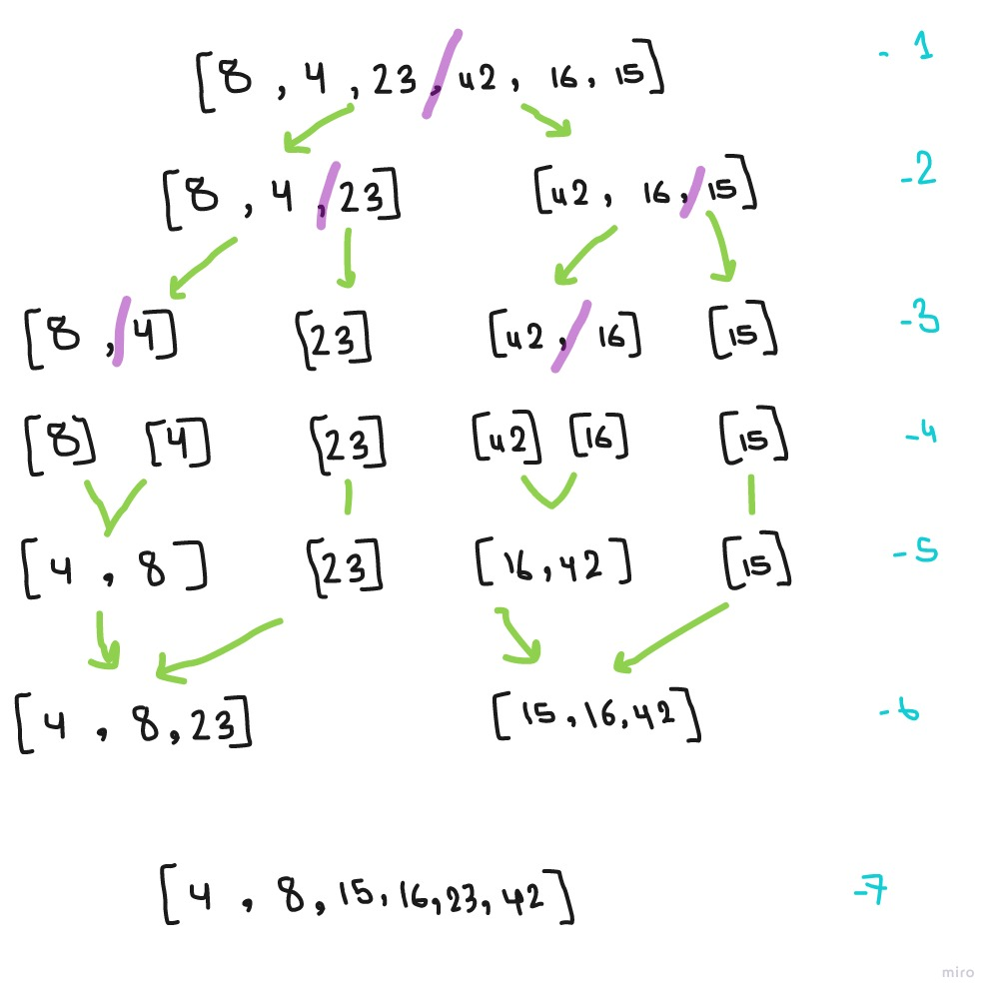

# Merge Sort Visual 

1. divide the array to two half's

2. divide the two arrays  to two half's each

3. divide the two arrays with more then one value to two half's each again

4. combine the two arrays that were separated last in a sorted manner

5. combine the two arrays that resulted from the previous step with the two arrays that were separated first in a sorted manner

6. combine the two arrays that resulted from the previous step with in a sorted manner