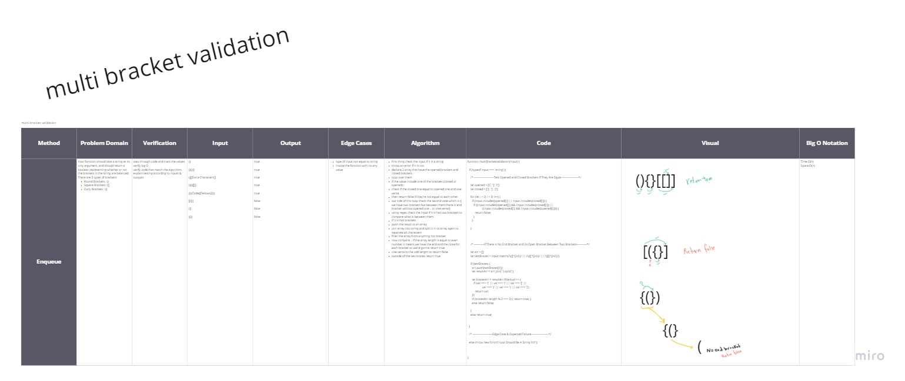

# Multi Bracket Validation 

### Method & Approach & Efficiency 

**multiBracketValidation(input)**

should take a string as its only argument, and should return a boolean representing whether or not the brackets in the string are balanced. There are 3 types of brackets:

Round Brackets : ()
Square Brackets : []
Curly Brackets : {}

```
- first thing check the input if it is a string
- throw an error if it is not
- declare 2 array that have the opened brackets and closed brackets
- loop over them
- if the value include one of the brackets (closed or opened) :
- check if the closed one equal to opened one and vise versa
- then return false if they're not equal to each other
- out side of this loop check the second case which is (( we have two brackets but between them there is end bracket - - - without opened one .. or vise versa))
- using regex check the input if it is has two brackets to compare what is between them
- if it is has brackets
- push the result to an array
- join array into string and split it in to array again to separate all characters
- filter the array from anything not bracket
- now compare .. if the array length is equal to even number it means we have the end and the close for each bracket so - - we're gonna return true
- vise versa to the odd length so return false
- outside of the test braces return true

```


## Tests ~

## [Actions](https://github.com/wafaankoush99/data-structures-and-algorithms/actions)

```
 PASS  Data-Structures/multiBracketValidation/multi-bracket-validation.test.js (10.844 s)
   Test-1 : Happy Path ==> Should Return True
    ✓ Case 1  (2 ms)
    ✓ Case 2
    ✓ Case 3  (1 ms)
    ✓ Case 4
    ✓ Case 5
   Test-2 : Happy Path ==> Should Return False
    ✓ Case 1  (1 ms)
    ✓ Case 2
    ✓ Case 3
    ✓ Case 4
    ✓ Case 5
    ✓ Case 6
   Test-3 : Edge Case & Expected Failure
    ✓ Case 1  (24 ms)
    ✓ Case 2  (1 ms)

-----------------------------|---------|----------|---------|---------|-------------------
File                         | % Stmts | % Branch | % Funcs | % Lines | Uncovered Line #s
-----------------------------|---------|----------|---------|---------|-------------------
All files                    |   95.45 |    77.78 |     100 |     100 |
 multi-bracket-validation.js |   95.45 |    77.78 |     100 |     100 | 27,34-38
-----------------------------|---------|----------|---------|---------|-------------------
Test Suites: 1 passed, 1 total
Tests:       13 passed, 13 total
Snapshots:   0 total
Time:        31.133 s

```

***


## [Board](https://miro.com/welcomeonboard/dOkjzgRTnt9alrFghkrIxAatu8NCTnci6ieC0eOSWrpBinCvR5aRwS5VbqrdDllD)




***

[Pull Request](https://github.com/wafaankoush99/data-structures-and-algorithms/pull/52)