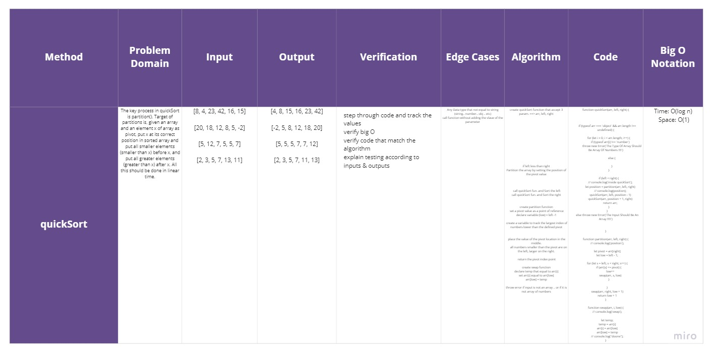

# Quick Sort

### Methods & Approach & Efficiency 

**quickSort(arr)**

The key process in quickSort is partition(). Target of partitions is, given an array and an element x of array as pivot, put x at its correct position in sorted array and put all smaller elements (smaller than x) before x, and put all greater elements (greater than x) after x. All this should be done in linear time.

```
create quickSort function that accept 3 param. ==> arr, left, right

if left less than right
Partition the array by setting the position of the pivot value

 call quickSort fun. and Sort the left
call quickSort fun. and Sort the right

create partition function
 set a pivot value as a point of reference
declare variable (low) = left -1

 create a variable to track the largest index of numbers lower than the defined pivot

 place the value of the pivot location in the middle.
      all numbers smaller than the pivot are on the left, larger on the right.

 return the pivot index point

create swap function
declare temp that equal to arr[i]
set arr[i] equal to arr[low]
arr[low] = temp

throw error if input is not an array .. or if it is not array of numbers
```

## Tests ~

## [Actions](https://github.com/wafaankoush99/data-structures-and-algorithms/actions)

```
 PASS  Data-Structures/quickSort/quikSort.test.js
  Happy Path
    Shoule retirn sorted array in these cases
      ✓ Normal case (19 ms)
      ✓ Reverse-sorted (1 ms)
      ✓ Few uniques
      ✓ Nearly-sorted (1 ms)
  Edge Cases And Failer Path
    Should Throw an error if the input is not an array
      ✓ String (5 ms)
      ✓ number
      ✓ object (1 ms)
      ✓ no call (1 ms)
    Should Throw an error if the array doesnt an array of numbers
      ✓ String

--------------|---------|----------|---------|---------|-------------------
File          | % Stmts | % Branch | % Funcs | % Lines | Uncovered Line #s
--------------|---------|----------|---------|---------|-------------------
All files     |     100 |      100 |     100 |     100 |
 quickSort.js |     100 |      100 |     100 |     100 |
--------------|---------|----------|---------|---------|-------------------
Test Suites: 1 passed, 1 total
Tests:       9 passed, 9 total
Snapshots:   0 total
Time:        1.085 s

```

***


## [Board](https://miro.com/welcomeonboard/Y0JzRXRsTUJxa2ZWWTNrbk9hcGhmc0h6aFd1VVhSb09ja2NqbEtWR1BhMFplZTFaYnZ5Y0l2dlRjS2J6b3VvNXwzMDc0NDU3MzU3MzU4Mjc2Mjk1)




## Blog 

## [Blog](./blog.md)


***

[Pull Request 1](https://github.com/wafaankoush99/data-structures-and-algorithms/pull/60)
