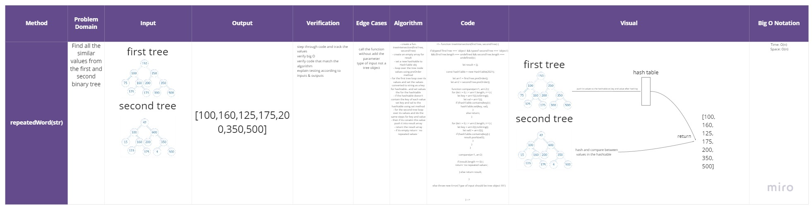

# Tree Intersection

### Methods & Approach & Efficiency 

**treeIntersection(fTree, sTree)**

Find all the similar values from the first and second binary tree

<!-- function treeIntersection(firstTree, secondTree) {

    if ((typeof firstTree === 'object' && typeof secondTree === 'object') && (firstTree.length === undefined && secondTree.length === undefined)) {

        let result = [];

        const hashTable = new HashTable(2021);

        let arr1 = firstTree.preOrder();
        let arr2 = secondTree.preOrder();

        function compare(arrr1, arrr2) {
            for (let i = 0; i < arrr1.length; i++) {
                let key = arrr1[i].toString();
                let val = arrr1[i];
                if (!hashTable.contains(key)) {
                    hashTable.set(key, val);
                }
                else return;
            }

            for (let i = 0; i < arrr2.length; i++) {
                let key = arrr2[i].toString();
                let val2 = arrr2[i];
                if (hashTable.contains(key)) {
                    result.push(val2);
                }
            }
        }

        compare(arr1, arr2)

        if (result.length <= 0) {
            return 'no repeated values';

        } else return result;

    }

    else throw new Error('Type of input should be tree object !!!!!')


} -->


```
- create a fun. treeIntersection(firstTree, secondTree) 
- create an empty array for result
- set a new hashtable to HashTable obj
- loop over the tree node values using preOrder method 
- for the first tree loop over its values and set the values converted to string as a key for hashtable.. and set values the for the hashtable
- if the hashtable doesn't contain the key of each value 
set key and val to the hashtable using set method
- for the second tree loop over its values and do the same steps for key and value 
- then if its conatin this value push it into result array
- return the result array
- if its empty return ' no repeated values '

```

## Tests ~

## [Actions](https://github.com/wafaankoush99/data-structures-and-algorithms/actions)

```
 PASS  Data-Structures/tree-intersection/tree-intersection.test.js
  Happy Path :)
    ✓ can return a set of values found in both trees (4 ms)
    ✓ can return a set of values found in both trees (1 ms)
  Edge Cases & Expected failer :(
    ✓ Should return message if there is no repeated values (1 ms)
    ✓ Should throw an error when the type of input is not a tree object (7 ms)

-----------------------------------|---------|----------|---------|---------|-------------------
File                               | % Stmts | % Branch | % Funcs | % Lines | Uncovered Line #s
-----------------------------------|---------|----------|---------|---------|-------------------
 Data-Structures/tree-intersection |      96 |    91.67 |     100 |   95.65 |
  tree-intersection.js             |      96 |    91.67 |     100 |   95.65 | 25
-----------------------------------|---------|----------|---------|---------|-------------------
Tests:       4 passed, 4 total
Snapshots:   0 total

```

***


## [Board](https://miro.com/welcomeonboard/MnIzdXZSWGRqRDhmRlp2WDlTWFpraDRKbjJ0eUtTTzZWcGJqT2RQRURuRmlBaVFHQmxwaGx0VVpPdGlldWR0c3wzMDc0NDU3MzU3MzU4Mjc2Mjk1)





***

[Pull Request 1](https://github.com/wafaankoush99/data-structures-and-algorithms/pull/63)


