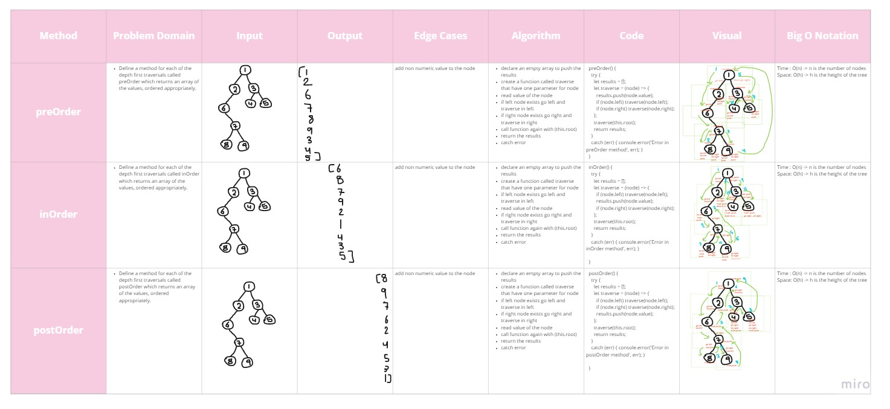

# TREE

## Methods & Approach & Efficiency 

## Binary Tree :

**preOrder()**

Define a method for each of the depth first traversals called preOrder which returns an array of the values, ordered appropriately.

```
- declare an empty array to push the results
- create a function called traverse that have one parameter for node
- read value of the node
- if left node exists go left and traverse in left
- if right node exists go right and traverse in right
- call function again with (this.root)
- return the results
- catch error

```

**inOrder()**

Define a method for each of the depth first traversals called inOrder which returns an array of the values, ordered appropriately.
```

- declare an empty array to push the results
- create a function called traverse that have one parameter for node
- if left node exists go left and traverse in left
- read value of the node
- if right node exists go right and traverse in right
- call function again with (this.root)
- return the results
- catch error


```

**postOrder()**

Define a method for each of the depth first traversals called  postOrder which returns an array of the values, ordered appropriately.


```

- declare an empty array to push the results
- create a function called traverse that have one parameter for node
- if left node exists go left and traverse in left
- if right node exists go right and traverse in right
- read value of the node
- call function again with (this.root)
- return the results
- catch error


```

## Binary Search Tree : 

**add(value)**

Define a method named add that accepts a value, and adds a new node with that value in the correct location in the binary search tree.


```
- create a method with (value) parameter
- set  a new Node to the node with a value
- declare  a current variable that equal to the root of the node
- iterate over the tree if there is a values
- if new node greater than current
- and the current.right exist set the current to current.right
- else set current.right equal to new node and break out
- if new node less than current
- if current .left exists
- set current to current.letf
- else set current .left to new node
- break out
- throw error if the new value not a number


```
**contains(value)**

Define a method named contains that accepts a value, and returns a boolean indicating whether or not the value is in the tree at least once.


```

- create a method that have a value parameter
- set a cuurent value to the root
- if value equal to current.value
- return true
- if its greater than current.value
- if current.right exists
- set current = current.right
- else return false
- if the value less than current value
- and current .left exists
- set the current to the left
- else return false
- throw an error if the value not a number

```

## Tests ~

## [Actions](https://github.com/wafaankoush99/data-structures-and-algorithms/actions)

```
 PASS  Data-Structures/tree/tree.test.js (15.438 s)
  Binary Tree TEST
    ✓ Can successfully instantiate an empty tree (1 ms)
    ✓ Can successfully instantiate a tree with a single root node
    ✓ Can successfully return a collection from a preorder traversal (1 ms)
    ✓ Can successfully return a collection from an inorder traversal (2 ms)
    ✓ Can successfully return a collection from a postorder traversal (1 ms)
  Binary Search Tree TEST
    ✓ Can successfully add a left child and right child to a single root node (1 ms)
    ✓ Should returns a boolean indicating whether or not the value is in the tree at least once. (1 ms)
  Edge Cases And Expected Faller
    ✓ Should through an error when add a non numerical value to add method (46 ms)
    ✓ Should through an error when add a non numerical value to contains method (1 ms)

----------|---------|----------|---------|---------|---------------------
File      | % Stmts | % Branch | % Funcs | % Lines | Uncovered Line #s
----------|---------|----------|---------|---------|---------------------
All files |   79.41 |    68.42 |     100 |   77.42 |
 tree.js  |   79.41 |    68.42 |     100 |   77.42 | 27,42,58,85,105-121
----------|---------|----------|---------|---------|---------------------
Test Suites: 1 passed, 1 total
Tests:       9 passed, 9 total
Snapshots:   0 total
Time:        38.251 s

```

***


## [Board](https://miro.com/welcomeonboard/VktiRjJSMFJjbHoxZ3hyYUVFMEhmZWVaYmd2cmpjNHM2UkZMMjdUeWpWajZ6WUdtSW1YNW9KRldtOU90SElaS3wzMDc0NDU3MzU3MzU4Mjc2Mjk1)

## Binay Tree ~



## Binay Search Tree ~


# Verification ~


***

[Pull Request](https://github.com/wafaankoush99/data-structures-and-algorithms/pull/53)


