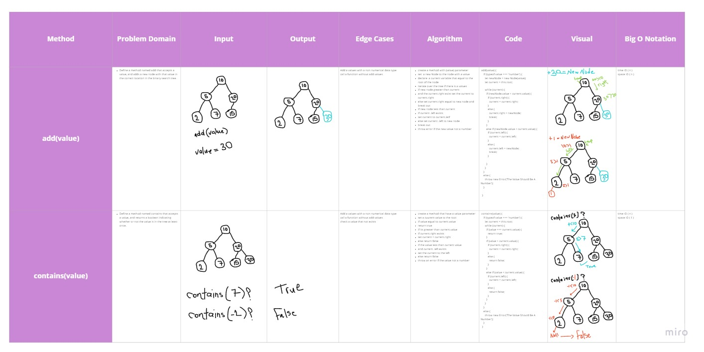
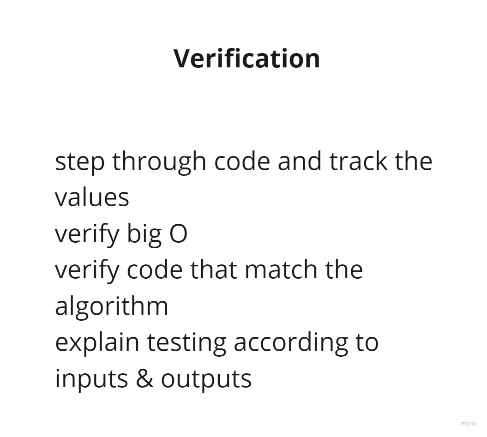

# TREE

## Methods & Approach & Efficiency 

## Binary Tree :

**preOrder()**

Define a method for each of the depth first traversals called preOrder which returns an array of the values, ordered appropriately.

```
- declare an empty array to push the results
- create a function called traverse that have one parameter for node
- read value of the node
- if left node exists go left and traverse in left
- if right node exists go right and traverse in right
- call function again with (this.root)
- return the results
- catch error

```

**inOrder()**

Define a method for each of the depth first traversals called inOrder which returns an array of the values, ordered appropriately.
```

- declare an empty array to push the results
- create a function called traverse that have one parameter for node
- if left node exists go left and traverse in left
- read value of the node
- if right node exists go right and traverse in right
- call function again with (this.root)
- return the results
- catch error


```

**postOrder()**

Define a method for each of the depth first traversals called  postOrder which returns an array of the values, ordered appropriately.


```

- declare an empty array to push the results
- create a function called traverse that have one parameter for node
- if left node exists go left and traverse in left
- if right node exists go right and traverse in right
- read value of the node
- call function again with (this.root)
- return the results
- catch error


```
**findMaximumValue()**

Write an instance method called find-maximum-value. Without utilizing any of the built-in methods available to your language, return the maximum value stored in the tree. You can assume that the values stored in the Binary Tree will be numeric.

```

- if tree not empty
- set a max variable and give it root value
- create a traverse function
- if left exisit traverse on it and the same for the right node
- if node vale greater than the root value (max)
- set max equal to it
- traverse on this.root and return the maximum value
- throw error if the tree was empty


```

**breadthFirst()**

Write a breadth first traversal method which takes a Binary Tree as its unique input. Without utilizing any of the built-in methods available to your language, traverse the input tree using a Breadth-first approach, and return a list of the values in the tree in the order they were encountered.


```

- if the tree not empty
- declare empty array for result
- set a new queue to the queue after require it
- enqueue the root of tree to the queue
- now that we have one node in our queue, we can dequeue it
- From our dequeued first node, we can enqueue the left and right
- repeat the process
- Dequeue the temp node, enqueue that node’s left and right nodes, and move to the next new temp of the queue.
- return the result
- throw an error when tree is empty


```


## Binary Search Tree : 

**add(value)**

Define a method named add that accepts a value, and adds a new node with that value in the correct location in the binary search tree.


```
- create a method with (value) parameter
- set  a new Node to the node with a value
- declare  a current variable that equal to the root of the node
- iterate over the tree if there is a values
- if new node greater than current
- and the current.right exist set the current to current.right
- else set current.right equal to new node and break out
- if new node less than current
- if current .left exists
- set current to current.letf
- else set current .left to new node
- break out
- throw error if the new value not a number


```
**contains(value)**

Define a method named contains that accepts a value, and returns a boolean indicating whether or not the value is in the tree at least once.


```

- create a method that have a value parameter
- set a cuurent value to the root
- if value equal to current.value
- return true
- if its greater than current.value
- if current.right exists
- set current = current.right
- else return false
- if the value less than current value
- and current .left exists
- set the current to the left
- else return false
- throw an error if the value not a number

```

## Tests ~

## [Actions](https://github.com/wafaankoush99/data-structures-and-algorithms/actions)

```
 PASS  Data-Structures/stacksAndQueues/stacks-and-queue.test.js
  Stacks
    ✓ Can successfully push onto a stack (2 ms)
    ✓ Can successfully push multiple values onto a stack (1 ms)
    ✓ Can successfully pop off the stack
    ✓ Can successfully empty a stack after multiple pops
    ✓ Should raise exception when called "POP" on empty stack (7 ms)
    ✓ Can successfully peek the next item on the stack
    ✓ Should raise exception when called "PEEK" on empty stack (1 ms)
    ✓ Can successfully instantiate an empty stack
  Queue
    ✓ Can successfully instantiate an empty queue
    ✓ Can successfully enqueue into a queue (1 ms)
    ✓ Can successfully enqueue multiple values into a queue (7 ms)
    ✓ Can successfully peek into a queue, seeing the expected value (1 ms)
    ✓ Can successfully dequeue out of a queue the expected value
    ✓ Calling peek on empty queue raises exception (1 ms)
    ✓ Can successfully empty a queue after multiple dequeues (1 ms)
    ✓ Calling dequeue on empty queue raises exception

----------------------|---------|----------|---------|---------|-------------------
File                  | % Stmts | % Branch | % Funcs | % Lines | Uncovered Line #s
----------------------|---------|----------|---------|---------|-------------------
All files             |     100 |    90.91 |     100 |     100 |
 stacks-and-queues.js |     100 |    90.91 |     100 |     100 | 82,163
----------------------|---------|----------|---------|---------|-------------------
Test Suites: 1 passed, 1 total
Tests:       16 passed, 16 total
Snapshots:   0 total
Time:        0.986 s, estimated 1 s

```

***


## [Board](https://miro.com/welcomeonboard/VktiRjJSMFJjbHoxZ3hyYUVFMEhmZWVaYmd2cmpjNHM2UkZMMjdUeWpWajZ6WUdtSW1YNW9KRldtOU90SElaS3wzMDc0NDU3MzU3MzU4Mjc2Mjk1)

## Binay Tree ~


## Binay Search Tree ~



# Verification ~




***

[Pull Request](https://github.com/wafaankoush99/data-structures-and-algorithms/pull/53)


