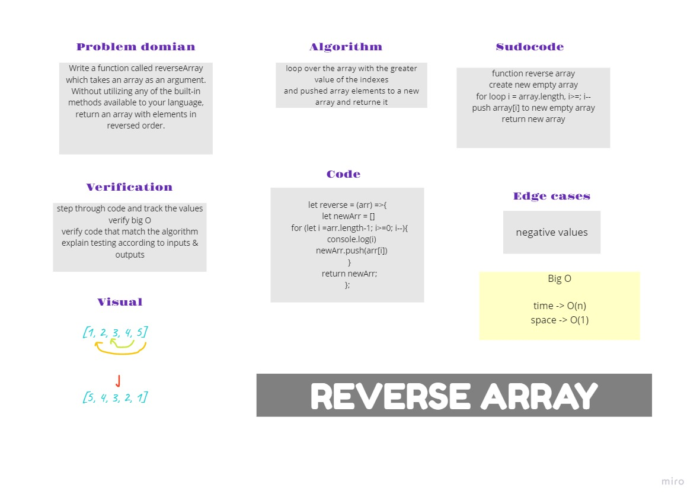

# Reverse an Array
Write a function called reverseArray which takes an array as an argument. Without utilizing any of the built-in methods available to your language, return an array with elements in reversed order.

[Board](https://miro.com/welcomeonboard/XV5WzC1LBoVeaKcpAqdW74ARdlK5T2f39vecqqVRRmLlVDEF0Pd5iaZcWm2xiRgu)
## Whiteboard Process


## code 

```js
let reverse = (arr) =>{
  let newArr = [];
  for (let i =arr.length-1; i>=0; i--){
    console.log(i);
    newArr.push(arr[i]);
  }
```

loop over the array with the greater value of the indexes
and pushed array elements to a new array and returne it


