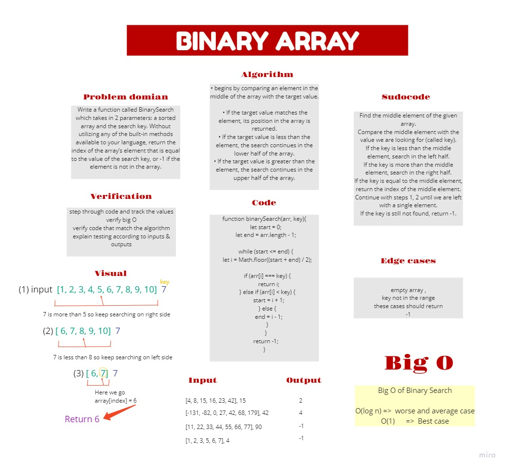

## Binary Array Challenge 

Takes an array and return the index of the array’s element that is equal to the value of the search key, or -1 if the element is not in the array.

[Board](https://miro.com/welcomeonboard/XV5WzC1LBoVeaKcpAqdW74ARdlK5T2f39vecqqVRRmLlVDEF0Pd5iaZcWm2xiRgu)



## Code 


```js
function binarySearch(arr, key){
  let start = 0;
  let end = arr.length - 1;

  while (start <= end) {
    let i = Math.floor((start + end) / 2);

    if (arr[i] === key) {
      return i;
    } else if (arr[i] < key) {
      start = i + 1;
    } else {
      end = i - 1;
    }
  }
  return -1;
}
```

use two variables to keep track of the start and end of the current subarray that we are searching.. 
then  find the middle element, and then check whether it is equal, lesser than, or greater than the key

