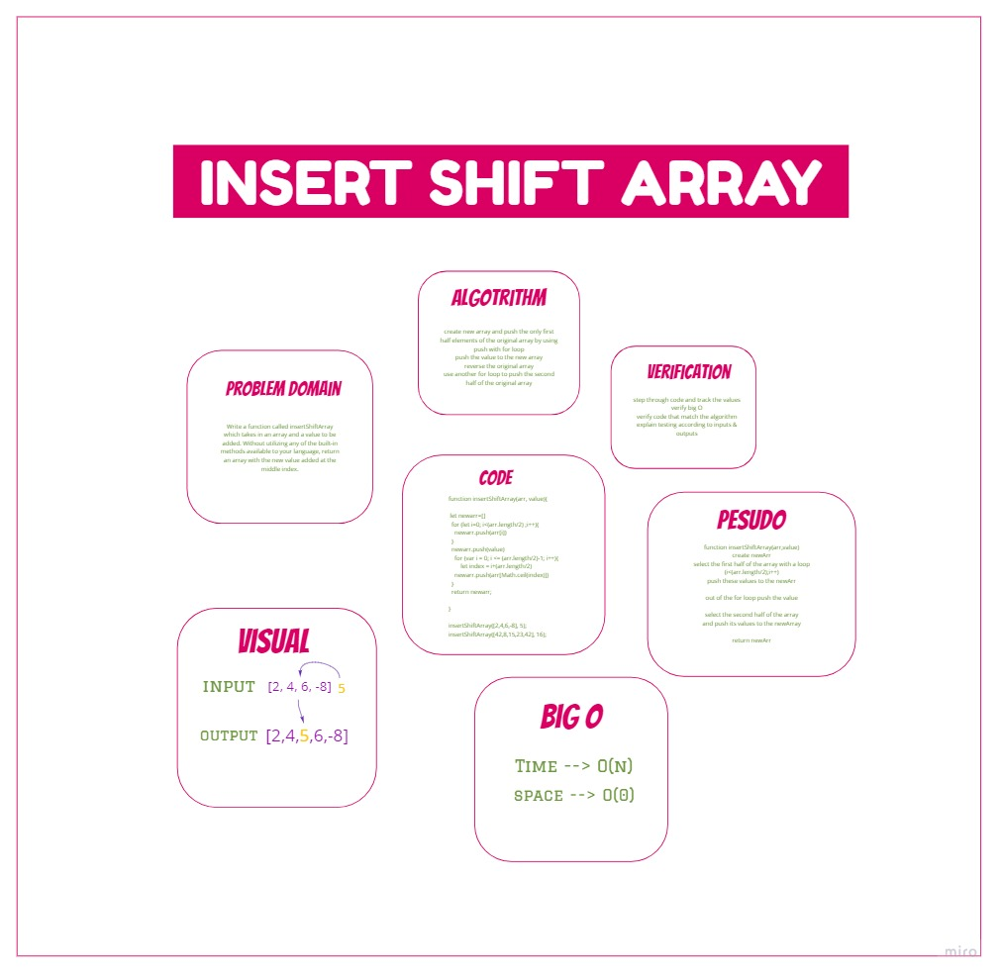

## Shift Array Challenge 

Takes an array then return it with the new value added at the middle index.

## [Board](https://miro.com/welcomeonboard/XV5WzC1LBoVeaKcpAqdW74ARdlK5T2f39vecqqVRRmLlVDEF0Pd5iaZcWm2xiRgu)



## CODE :

```
function insertShiftArray(arr, value){

  let newarr=[]
  for (let i=0; i<(arr.length/2) ;i++){
    newarr.push(arr[i])
  }
  newarr.push(value)
    for (var i = 0; i <= (arr.length/2)-1; i++){
        let index = i+(arr.length/2)
    newarr.push(arr[Math.ceil(index)])
  }
  return newarr;

}

insertShiftArray([2,4,6,-8], 5);
insertShiftArray([42,8,15,23,42], 16);
```

The solution done by createing empty array and pushed 3 things to it :

1- first half of the array

2- The Value 

3- second Half of the array

and returned the new Array 
